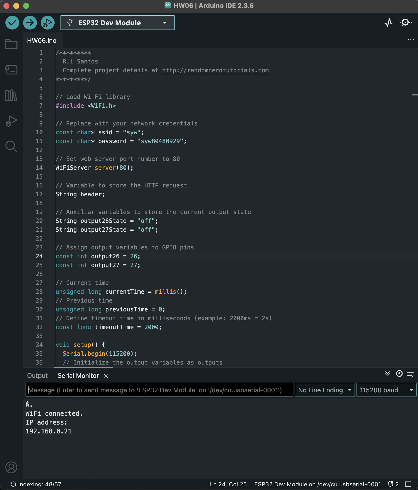

# IoT25-HW04

# IoT25-HW05

 
videos
 
https://github.com/redbrick01/IoT25-HW04-HW07/blob/700b33ce100ab9b43e2979ed0d68d238b1f2adb2/images/HW05_code.mp4
 
https://github.com/redbrick01/IoT25-HW04-HW07/blob/700b33ce100ab9b43e2979ed0d68d238b1f2adb2/images/HW05_result.mp4

# IoT25-HW06

 
video
 
https://github.com/redbrick01/IoT25-HW04-HW07/blob/700b33ce100ab9b43e2979ed0d68d238b1f2adb2/images/HW06_result.mp4

# Iot25-HW07

After several experiments, we identified suitable values for txPower and n
 
vidoes
 
https://github.com/redbrick01/IoT25-HW04-HW07/blob/700b33ce100ab9b43e2979ed0d68d238b1f2adb2/images/HW07_led.mp4
 
https://github.com/redbrick01/IoT25-HW04-HW07/blob/700b33ce100ab9b43e2979ed0d68d238b1f2adb2/images/HW07_result.mp4
